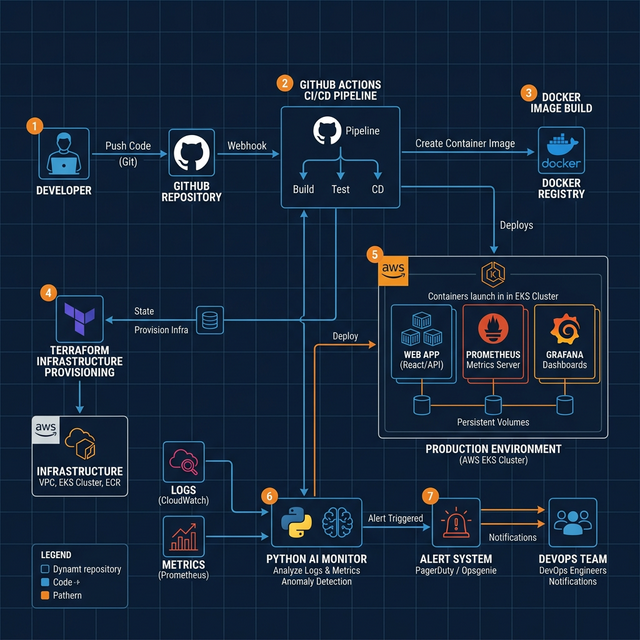

# 🛰️ AI-Powered DevOps Monitoring & Automation Platform

### _Enterprise Automation, Intelligent Observability, and Predictive Operations_

[](https://www.docker.com/)
[](https://www.terraform.io/)
[](https://www.python.org/)
[](https://github.com/features/actions)
[](https://prometheus.io/)

---

## 🚀 Project Overview

This repository showcases a **production-grade DevOps Monitoring Platform** that bridges the gap between traditional infrastructure automation and **intelligent, AI-powered system health analysis**. Built for high-availability environments, this project demonstrates a complete engineering lifecycle: from automated cloud provisioning (IaC) to real-time incident detection using custom AI monitoring agents.

### 🎯 Key Engineering Objectives

- **Automated Infrastructure**: Declarative environment provisioning using Terraform.
- **Microservices Orchestration**: Scalable containerization with Docker & Docker Compose.
- **Predictive Monitoring**: AI-driven log analysis to identify silent system failures.
- **Full Observability**: Real-time metric scraping and visualization via Prometheus and Grafana.

---

## 🏗️ Architecture & Technical Workflow



> **Operational Logic**: The platform follows a Continuous Operations methodology. GitHub Actions automates the build/test cycle, while the AI Monitoring layer provides 360° visibility by correlating system metrics with application logs to detect and alert on anomalies automatically.

---

## 🛠️ Core Technology Stack

| Domain                     | Technology                                          |
| :------------------------- | :-------------------------------------------------- |
| **Infrastructure as Code** | Terraform (VPC, Compute, IAM, Security Groups)      |
| **Containerization**       | Docker, Docker Compose (Nginx, Prometheus, Grafana) |
| **CI/CD Pipeline**         | GitHub Actions (Build, Lint, AI Component Testing)  |
| **Intelligent Monitoring** | Python (Log Analysis, Anomaly Scaling, Alerting)    |
| **Observability**          | Prometheus (Metrics), Grafana (Visualization)       |
| **Automation**             | Bash Shell Scripting                                |

---

## 🧠 AI-Powered Monitoring Engine

The heart of this platform is a sophisticated **Python AI Suite** designed for proactive system health management:

- **`log_analyzer.py`**: Utilizes complex pattern matching to identify critical error signatures across distributed logs.
- **`anomaly_detector.py`**: Employs statistical baseline analysis to detect performance drifts (CPU/Memory Spikes) and trigger auto-scaling alerts.
- **`alert_manager.py`**: Provides an intelligent notification framework for prioritized incident resolution.

---

## 🚀 Getting Started & Deployment

### 📋 Prerequisites

- **Terraform** v1.0+ & **Docker** / **Docker Compose**
- **AWS CLI** configured for infrastructure provisioning
- **Python 3.9+** for local monitoring script execution

### ⚙️ Rapid Setup

```bash
# 1. Clone the repository
git clone https://github.com/01Sachinc/ai-devops-monitoring-platform.git
cd ai-devops-monitoring-platform

# 2. Deploy the automated monitoring stack
./scripts/deploy.sh

# 3. Access Live Dashboards
# Web App: http://localhost:8080 | Metrics: http://localhost:9090
```

---

## 🖼️ Production Dashboard

_(Visual evidence of system performance)_

| **CI/CD Status**                                                                    | **Observability**               | **AI Alerts**               |
| :---------------------------------------------------------------------------------- | :------------------------------ | :-------------------------- |
|  | Real-time Grafana Visualization | Terminal-based Anomaly Logs |

---

## 👨‍💻 Developed By

**Sachin C S**  
_AWS Cloud & DevOps Specialist | Automation Engineer_

[](https://www.linkedin.com/in/sachin-c-s/)
[](https://github.com/01Sachinc)

📧 **Email**: [cssachin83@gmail.com](mailto:cssachin83@gmail.com)  
📱 **Phone**: +91 8496001030

---

_Built for the next generation of DevOps Professionalism._
